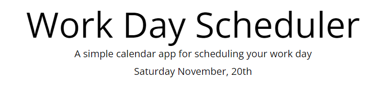

# schedule
Work Day Scheduler

Description
The intent of this project is to construct a a simple calendar application that allows a user to save events for each hour of the day. This app will run in the browser and feature dynamically updated HTML and CSS powered by jQuery.

Usage
Click on any box in each time slot, click the save icon to the right, and it will save the event that you have typed.
The colors will notify you when past, present, and future is. The current date will always appear at the top of the page.

Credits
Bo Kok
SMU

License
You are able to use this code as you wish.
https://github.com/BoKok/schedule
https://bokok.github.io/schedule/index